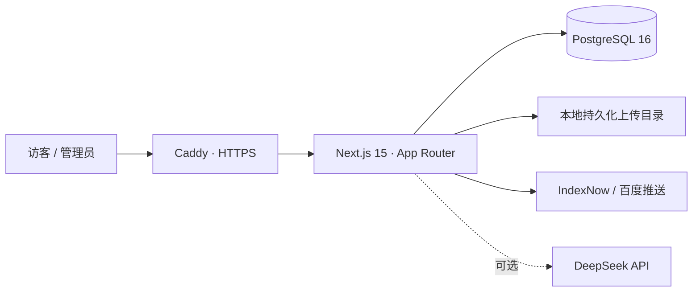

<div align="center">

# Suxin Blog

一个可自行部署的个人内容站与后台管理系统，基于 Next.js 15、React 19 和 PostgreSQL 构建。

文章、瞬间、作品、相册、ACG、友链、站点设置与 SEO 工具，都收进同一套内容工作流。

<p>
  <a href="https://haiy.space"><strong>访问线上站点</strong></a> ·
  <a href="#快速开始">快速开始</a> ·
  <a href="#生产部署">生产部署</a> ·
  <a href="docs/repository-structure.md">项目结构</a>
</p>

<p>
  
  
  
  
  
  
</p>

</div>

## 项目简介

Suxin Blog 不只是一个博客页面。它同时提供公开内容站、受保护的管理后台、媒体存储、搜索引擎提交和完整的 Docker 部署链路，适合希望自己掌控内容、数据和服务器的个人站长。

线上实例：[haiy.space](https://haiy.space)

## 功能亮点

| 模块 | 能力 |
| --- | --- |
| 文章 | 富文本编辑、分类、标签、封面池、评论、SEO 元数据与发布管理 |
| 瞬间 | 动态流、图片内容、点赞、评论和分享统计 |
| 作品 | 项目列表、详情页、封面与展示信息管理 |
| ACG | 动漫追番、游戏收藏和后台录入维护 |
| 相册 | 相册分组、图片与视频上传、媒体资源管理 |
| 友链 | 前台申请、头像抓取、后台审核和分类管理 |
| AI 写作 | 可选接入 DeepSeek，在后台辅助生成文章内容 |
| 站点体验 | 响应式布局、主题切换、场景背景、天气视觉层和可配置站点资料 |
| 管理与接入 | Auth.js 登录、管理员账户配置、API Key 鉴权 |
| SEO | Sitemap、Robots、RSS、Canonical、Open Graph、IndexNow 与百度推送 |
| 运维 | PostgreSQL 持久化、业务备份导入导出、Docker Compose、Caddy 自动 HTTPS |

## 技术架构



核心技术：

- Next.js 15、React 19、TypeScript 5
- Tailwind CSS、GSAP、TipTap
- Auth.js v5、Zod、SWR
- PostgreSQL 16、`pg`
- Docker Compose、Caddy

## 快速开始

### 环境要求

- Node.js 20+
- npm 10+
- PostgreSQL 16（本地开发）或 Docker + Docker Compose（容器部署）

### 1. 安装依赖

```bash
git clone https://github.com/Sunhaiy/suxin-blog.git
cd suxin-blog
npm install
```

### 2. 配置环境变量

```bash
cp .env.local.example .env.local
```

至少需要配置：

| 分类 | 变量 |
| --- | --- |
| 数据库 | `DATABASE_URL`，或 `PGHOST`、`PGPORT`、`PGDATABASE`、`PGUSER`、`PGPASSWORD` |
| 登录认证 | `AUTH_SECRET`、`AUTH_URL`、`ADMIN_EMAIL`、`ADMIN_PASSWORD` |
| 站点地址 | `NEXT_PUBLIC_BASE_URL` |
| 上传存储 | `UPLOAD_DIR`、`UPLOAD_PUBLIC_PATH` |

DeepSeek、站长平台验证、IndexNow、百度推送和管理员 API Key 均为可选配置，完整字段与注释见 [.env.local.example](.env.local.example)。

### 3. 初始化数据库

```bash
npm run db:migrate
```

如果只用于本地演示，可以写入示例数据：

```bash
npm run db:seed
```

> `db:seed` 会清空并重建演示数据，请勿在生产环境执行。

### 4. 启动开发服务器

```bash
npm run dev
```

- 前台：<http://localhost:3000>
- 后台登录：<http://localhost:3000/admin/login>

## 常用命令

| 命令 | 说明 |
| --- | --- |
| `npm run dev` | 启动开发服务器 |
| `npm run lint` | 运行 ESLint |
| `npm run lint:fix` | 自动修复可修复的 ESLint 问题 |
| `npm run build` | 构建生产版本 |
| `npm run start` | 启动生产服务器 |
| `npm run db:migrate` | 执行数据库迁移 |
| `npm run db:seed` | 清空并写入演示数据 |
| `npm run backup:export` | 导出站点业务数据 |
| `npm run backup:import` | 导入站点业务数据 |
| `npm run site:set-url` | 更新数据库中的站点 URL |

## 生产部署

仓库提供多阶段 [Dockerfile](Dockerfile)、[Docker Compose](docker-compose.prod.yml) 和 [Caddy](deploy/Caddyfile) 配置。生产拓扑由三个容器组成：

- `db`：PostgreSQL 16，数据保存到 `./data/postgres`
- `app`：在镜像构建阶段完成 Next.js 构建，运行阶段只启动应用
- `caddy`：反向代理、HTTP 跳转 HTTPS、证书申请与自动续签

准备生产 `.env`，并将 `deploy/Caddyfile` 中的域名改为自己的域名后启动：

```bash
docker compose -f docker-compose.prod.yml up -d --build
```

检查运行状态：

```bash
docker compose -f docker-compose.prod.yml ps
docker compose -f docker-compose.prod.yml logs --tail=100 app
```

更新应用：

```bash
docker compose -f docker-compose.prod.yml build app
docker compose -f docker-compose.prod.yml up -d app
```

完整的上线、备份和迁移步骤见 [部署与迁移说明](docs/deployment.md)。

## 数据与备份

生产环境需要同时保护三类数据：

1. PostgreSQL 数据：`./data/postgres`
2. 上传文件：`./data/uploads`
3. 生产环境变量：`.env`

`npm run backup:export` 和 `npm run backup:import` 用于业务数据迁移；上传文件仍需单独备份。不要把 `.env`、数据库目录或用户上传内容提交到 Git。

## 仓库结构

```text
app/                    App Router 页面、后台与 API 路由
components/             通用 UI、后台组件、内容组件与场景组件
features/               面向业务的客户端功能模块
hooks/                  通用 React Hooks
lib/                    数据库、认证、SEO、存储、校验与编辑器能力
public/                 静态资源与字体
scripts/                备份、导入、站点配置与资源处理脚本
deploy/                 Caddy 等部署配置
docs/                   架构、部署与 SEO 文档
types/                  全局类型定义
```

## SEO 与站长工具

项目默认提供：

- `/sitemap.xml`、`/robots.txt`、`/rss.xml`
- Canonical、Open Graph、Twitter Card
- Google、Bing、百度站点验证码
- Microsoft Clarity
- IndexNow 自动提交
- 百度普通收录推送
- 后台手动提交接口 `POST /api/seo/submit`

配置方法见 [SEO 配置说明](docs/seo.md)。

## 安全说明

- 不要提交 `.env` 或 `.env.local`
- 生产环境必须更换 `AUTH_SECRET`、管理员密码和 API Key
- 建议服务器使用 SSH 密钥登录，并限制密码与 root 远程登录
- 对外开放前请确认上传限制、备份策略和反向代理配置

## 文档

- [仓库结构说明](docs/repository-structure.md)
- [部署与迁移说明](docs/deployment.md)
- [SEO 配置说明](docs/seo.md)

## License

当前仓库按私有项目方式维护，尚未附带开源许可证。未经许可，请勿将代码视为开放授权的软件使用或再分发。
