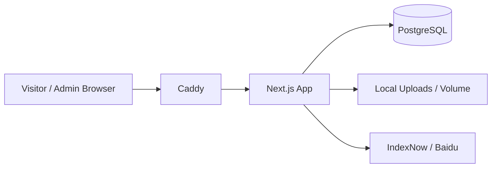

<div align="center">

# Suxin Blog

一个基于 `Next.js 15`、`React 19`、`PostgreSQL` 的个人内容站与后台管理系统。

前台内容站、后台控制台、SEO 自动提交通道、Docker 部署链路都在同一个仓库里。

<p>
  
  
  
  
  
  
</p>

<p>
  <a href="#功能亮点">功能亮点</a> ·
  <a href="#快速开始">快速开始</a> ·
  <a href="#仓库结构">仓库结构</a> ·
  <a href="docs/deployment.md">部署迁移</a> ·
  <a href="docs/seo.md">SEO 说明</a>
</p>

</div>

## 项目定位

这个仓库适合这几类场景：

- 想做一个有后台的个人博客，而不是只有静态展示页
- 想把文章、瞬间、作品、ACG、相册、友链放进同一套内容系统
- 想自己掌控部署、数据、SEO 和后续迁移

## 功能亮点

| 模块 | 当前能力 |
| --- | --- |
| 文章系统 | 富文本编辑器、分类、标签、SEO 字段、封面池、发布链路 |
| 瞬间系统 | 动态流、点赞、评论、分享统计 |
| 作品系统 | 项目展示、封面管理、详情展示 |
| ACG | 动漫追番、游戏收藏、后台录入维护 |
| 友链系统 | 前台申请、后台审核、分类管理 |
| 相册系统 | 相册与媒体资源管理 |
| 站点设置 | 头像、站名、主题色、首页背景、游戏 Hero 图等 |
| SEO | `sitemap`、`robots`、RSS、IndexNow、百度推送 |
| 运维 | Docker Compose、Caddy HTTPS、备份导入导出 |

## 技术架构



## 仓库结构

```text
app/                    App Router 页面、路由组、API 路由
components/             通用 UI、后台组件、场景组件
features/               面向业务的客户端模块封装
lib/                    数据库、认证、SEO、存储、校验、编辑器能力
public/                 静态资源
scripts/                备份、导入、站点配置等脚本
deploy/                 反向代理配置
types/                  全局类型定义
docs/                   仓库说明、部署与 SEO 文档
```

进一步阅读：

- [仓库结构说明](docs/repository-structure.md)
- [部署与迁移说明](docs/deployment.md)
- [SEO 配置说明](docs/seo.md)

## 快速开始

### 1. 安装依赖

```bash
npm install
```

### 2. 配置环境变量

```bash
cp .env.local.example .env.local
```

最少需要确认这些变量：

- `DATABASE_URL`
- `PGHOST`
- `PGPORT`
- `PGDATABASE`
- `PGUSER`
- `PGPASSWORD`
- `AUTH_SECRET`
- `AUTH_URL`
- `ADMIN_EMAIL`
- `ADMIN_PASSWORD`
- `NEXT_PUBLIC_BASE_URL`
- `UPLOAD_DIR`
- `UPLOAD_PUBLIC_PATH`

### 3. 初始化数据库

```bash
npm run db:migrate
```

如果只是本地演示，再执行：

```bash
npm run db:seed
```

`db:seed` 会清空并重建演示数据，不要在正式环境使用。

### 4. 启动开发环境

```bash
npm run dev
```

默认入口：

- 前台：`http://localhost:3000`
- 后台登录：`http://localhost:3000/admin/login`

## 常用脚本

| 命令 | 说明 |
| --- | --- |
| `npm run dev` | 启动开发环境 |
| `npm run lint` | 运行 ESLint |
| `npm run build` | 构建生产版本 |
| `npm run start` | 启动生产服务 |
| `npm run db:migrate` | 执行数据库迁移 |
| `npm run db:seed` | 写入演示数据 |
| `npm run backup:export` | 导出站点业务备份 |
| `npm run backup:import` | 导入站点业务备份 |
| `npm run site:set-url` | 写入站点 URL |

## 生产部署

仓库内置的部署文件：

- [Dockerfile](Dockerfile)
- [docker-compose.prod.yml](docker-compose.prod.yml)
- [deploy/Caddyfile](deploy/Caddyfile)

基础启动方式：

```bash
docker compose -f docker-compose.prod.yml up -d --build
```

当前生产方案默认包含：

- `PostgreSQL` 独立容器
- `Next.js` 应用容器
- `Caddy` 自动 HTTPS 与证书续签
- 上传目录卷挂载持久化

详细流程见 [部署与迁移说明](docs/deployment.md)。

## SEO

仓库已经内置：

- `sitemap.xml`
- `robots.txt`
- RSS
- 文章页 canonical / Open Graph / Twitter Card
- IndexNow 自动提交
- 百度普通收录推送
- 后台手动补提接口 `POST /api/seo/submit`

平台接入与变量说明见 [SEO 配置说明](docs/seo.md)。
如果你要对接 Google / Bing / 百度站长平台，优先配置：

- `GOOGLE_SITE_VERIFICATION`
- `BING_SITE_VERIFICATION`
- `BAIDU_SITE_VERIFICATION`
- `MICROSOFT_CLARITY_ID`
- `INDEXNOW_KEY`
- `BAIDU_TOKEN`

## 数据与迁移

这个项目的迁移不只是“把代码拉到另一台机器”。

正式迁移时要一起带走：

- PostgreSQL 数据
- `public/uploads` 或对应的持久卷
- 生产环境变量

如果域名不变，通常流程就是：

1. 恢复数据库
2. 恢复上传文件
3. 启动新容器
4. 把域名解析切到新 IP

## 仓库约定

- `.env`、`.env.local`、`public/uploads`、`data/`、`backups/` 不会提交
- `.next/`、`*.tsbuildinfo`、`coverage/` 等本地产物不会提交
- 提交前建议至少运行一次 `npm run lint` 和 `npm run build`

## 文档导航

- [仓库结构说明](docs/repository-structure.md)
- [部署与迁移说明](docs/deployment.md)
- [SEO 配置说明](docs/seo.md)

## License

当前仓库按私有项目方式维护。

如果后续准备公开发布，建议补充正式的 `LICENSE` 文件与开源边界说明。
